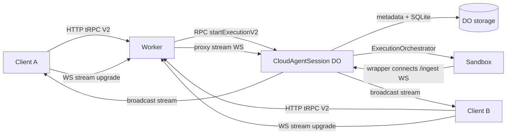
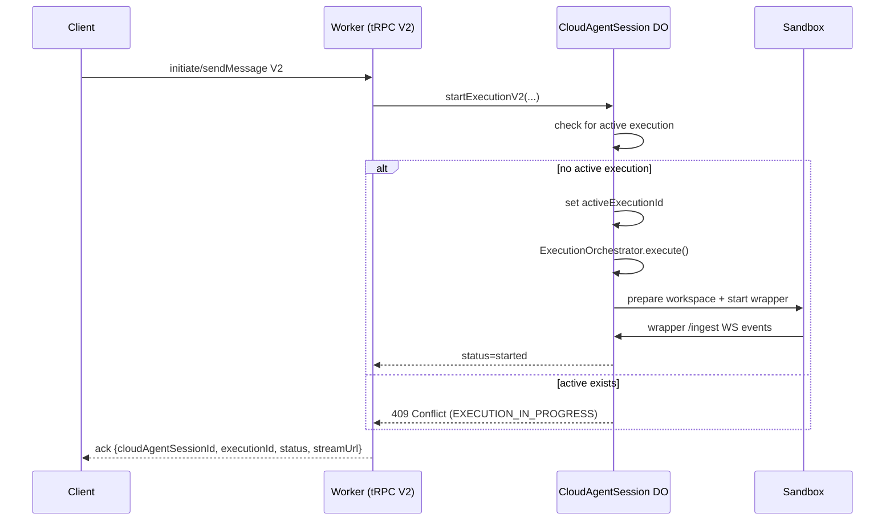
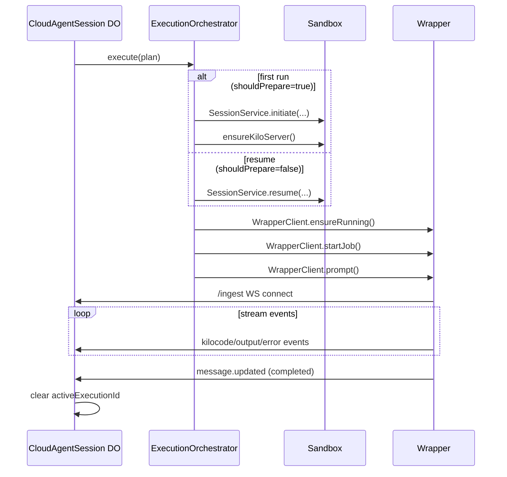
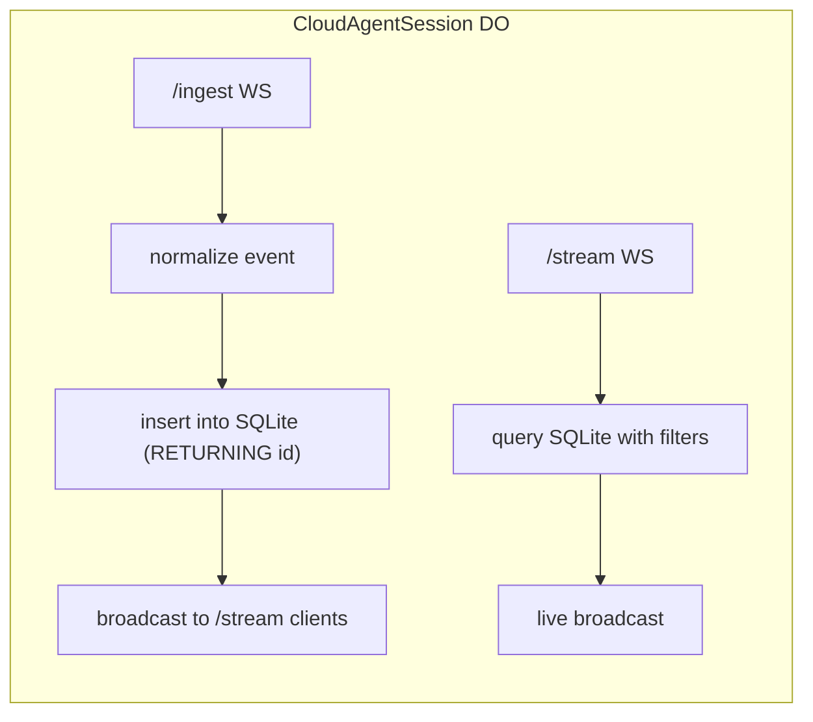
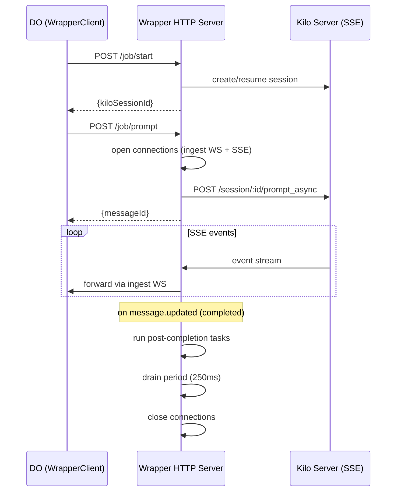
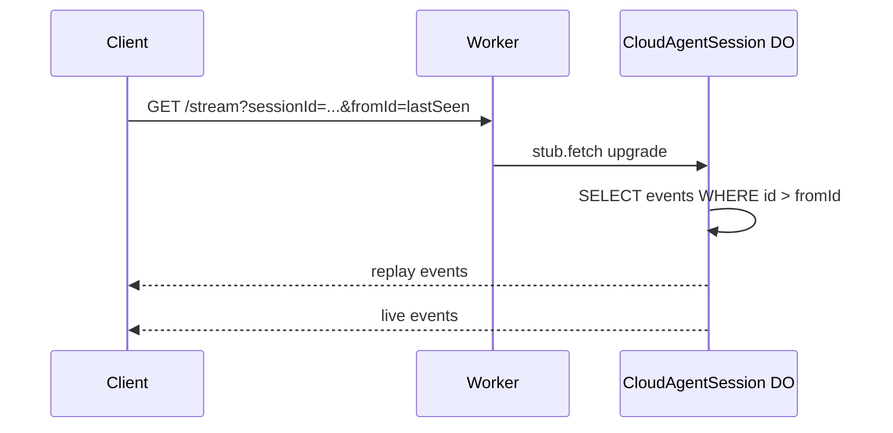
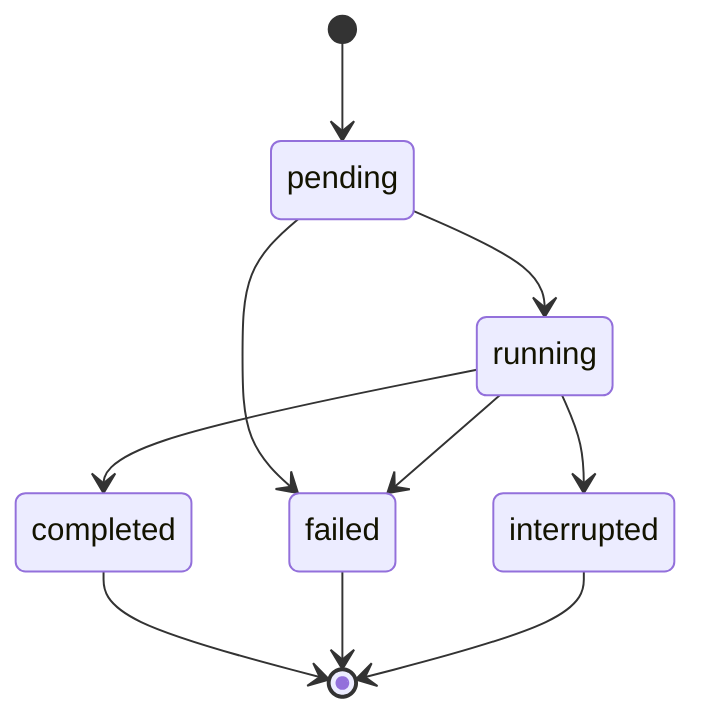
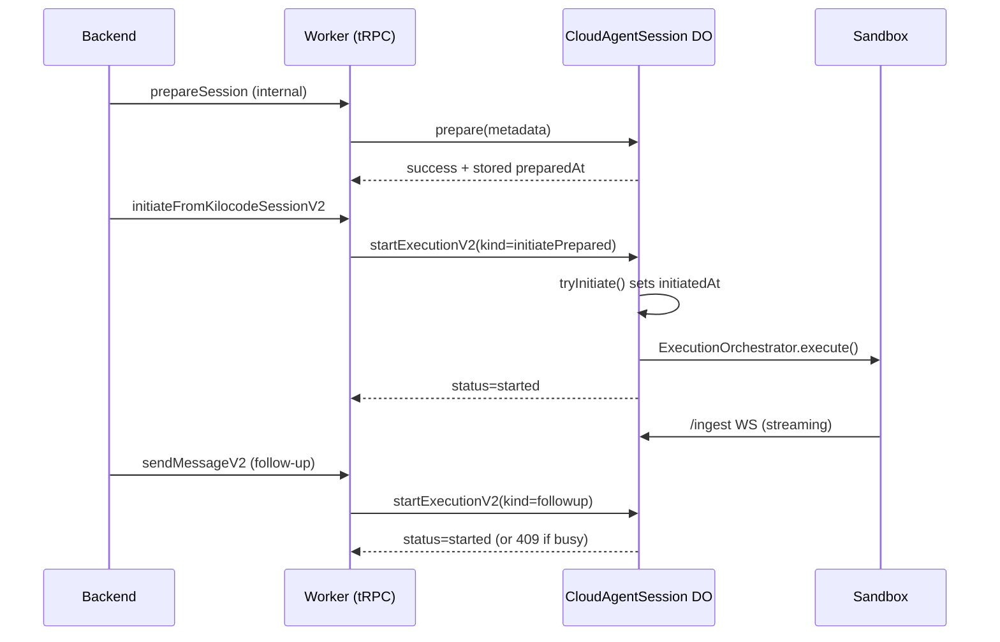
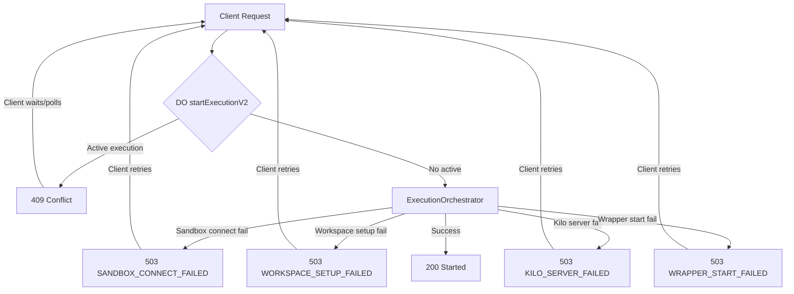

# Cloud-Agent WebSockets: Core Diagrams

These diagrams capture the core loops/patterns for the direct execution model,
DO ingestion + replay, and client reconnect.

---

## 1) System overview (data flow)

---

## 2) Direct execution handoff

---

## 3) Execution lifecycle (start/resume)

---

## 4) DO ingest + stream handling

---

## 5) Wrapper lifecycle

---

## 6) Client reconnect + replay

---

## 7) Execution state machine (high-level)

---

## 8) Prepared session lifecycle (prepare → initiate → follow-up)

---

## 9) Error handling and retries

