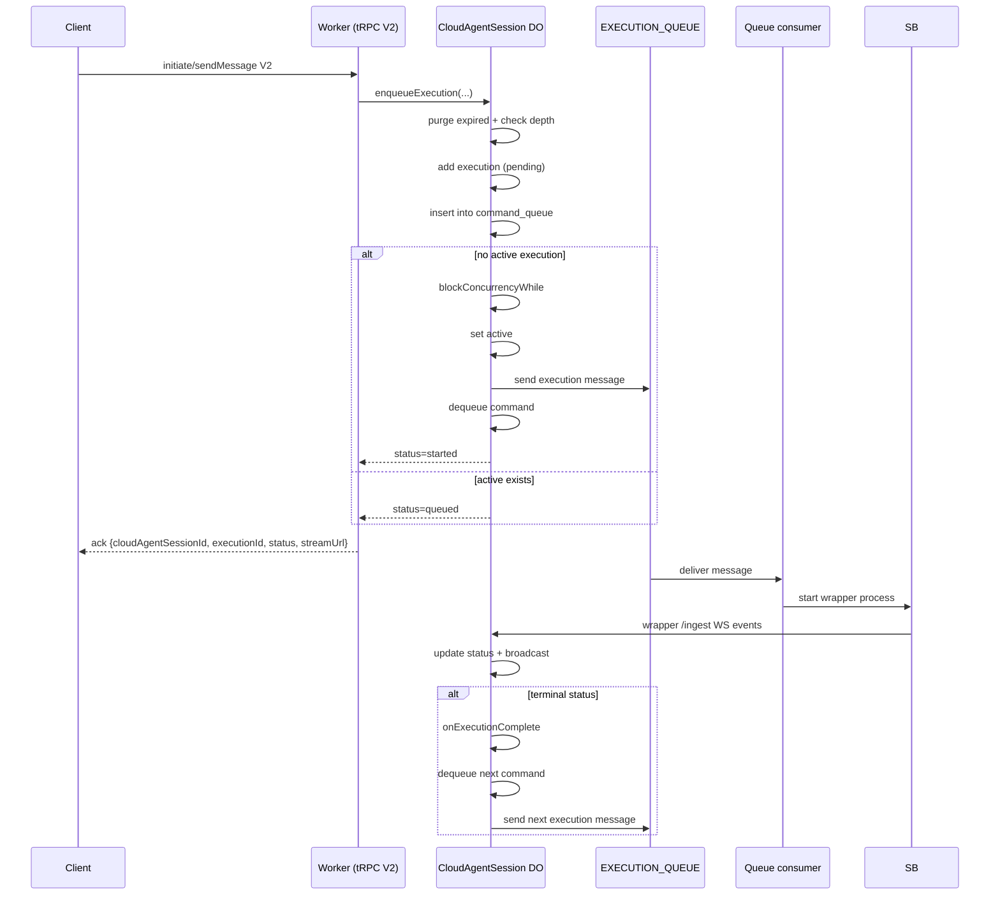
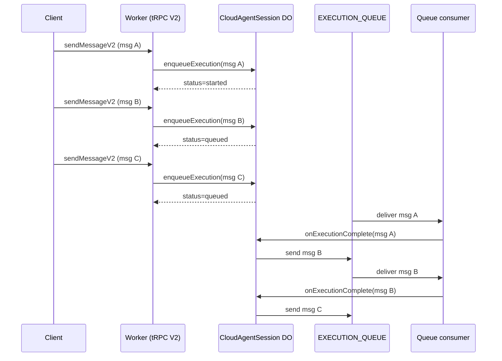
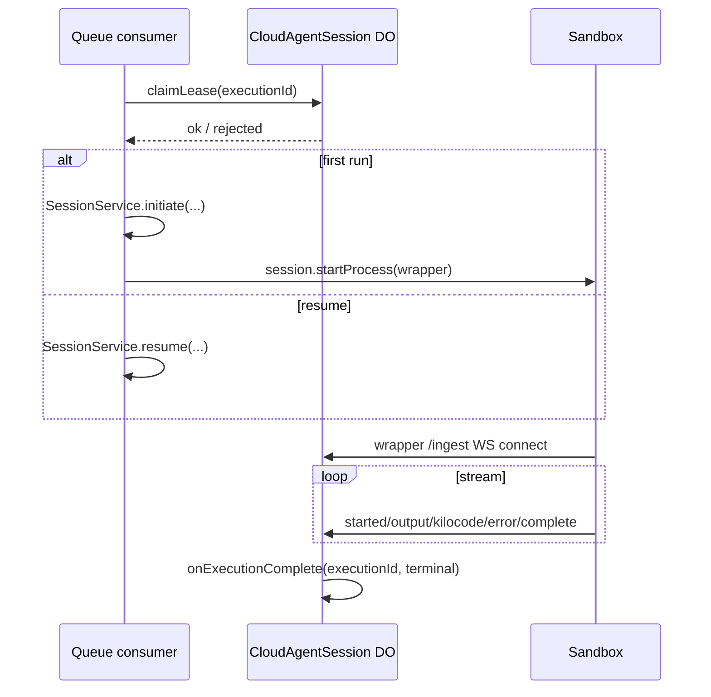
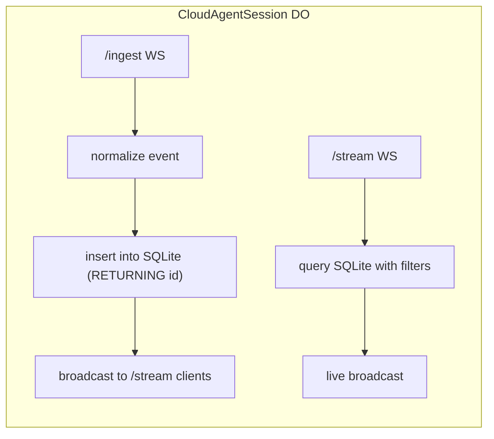
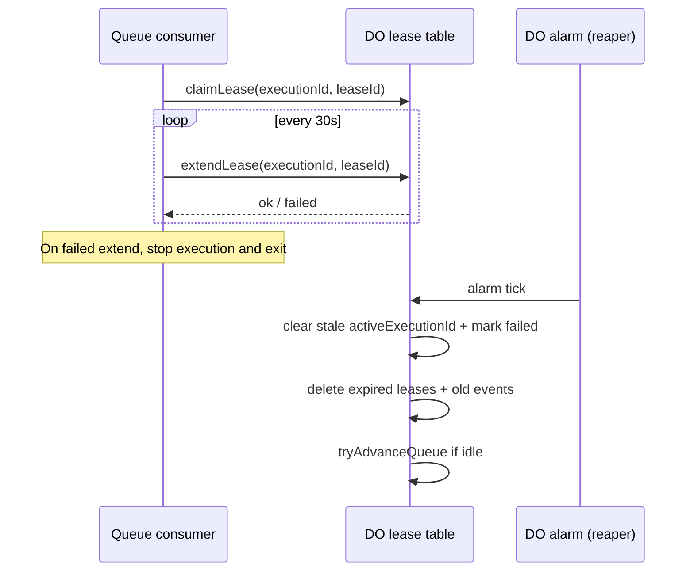
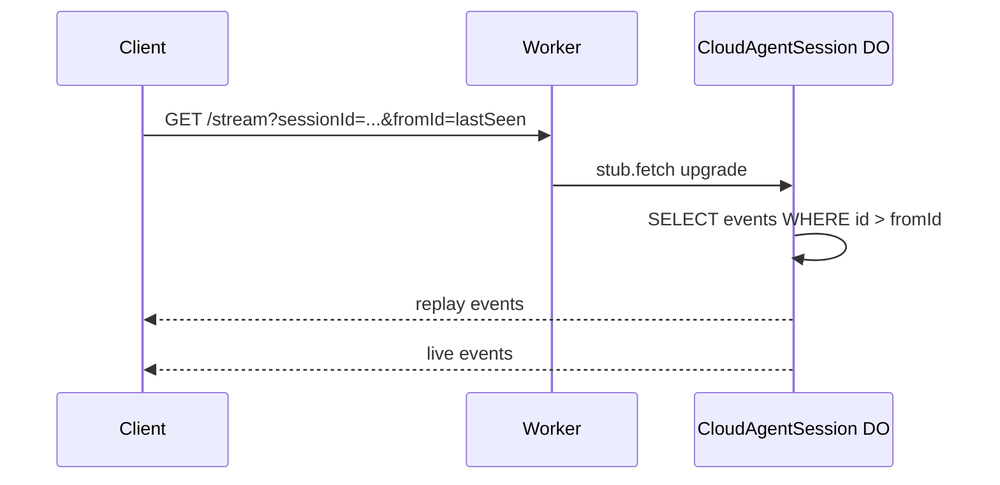
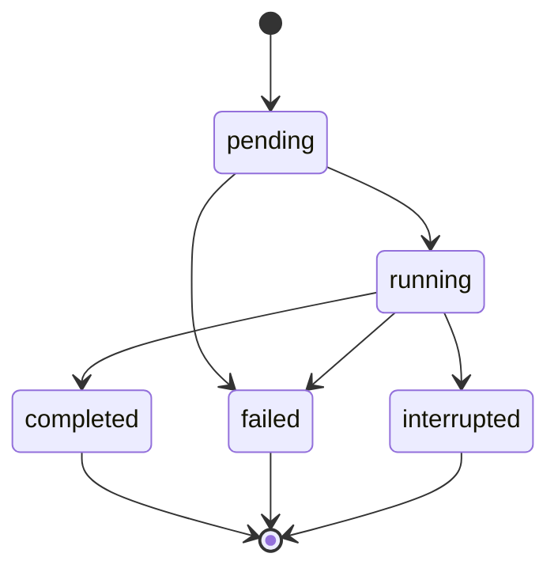
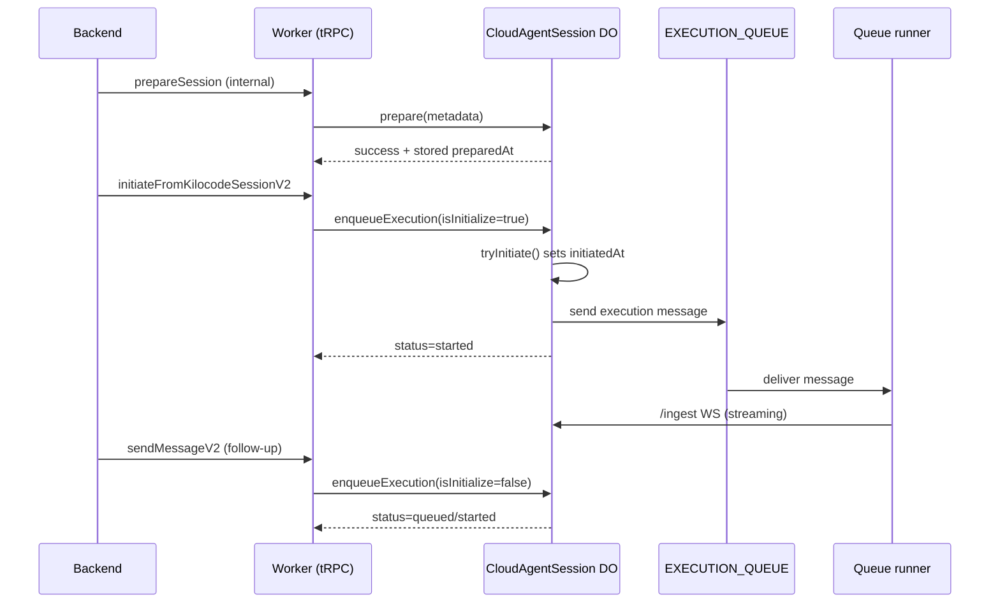

# Cloud-Agent WebSockets: Core Diagrams

These diagrams capture the core loops/patterns for the queue-backed execution
runner, DO ingestion + replay, and client reconnect.

---

## 1) System overview (data flow)

```mermaid
flowchart LR
  clientA[Client A] -->|HTTP tRPC V2 enqueue| worker[Worker]
  clientB[Client B] -->|HTTP tRPC V2 enqueue| worker
  clientA -->|WS stream upgrade| worker
  clientB -->|WS stream upgrade| worker
  worker -->|RPC enqueueExecution| do[CloudAgentSession DO]
  worker -->|proxy stream WS| do
  do -->|metadata + SQLite| storage[(DO storage)]
  do -->|enqueue next| queue[EXECUTION_QUEUE]
  queue --> consumer[Queue consumer]
  consumer -->|SessionService + startProcess(wrapper)| sandbox[Sandbox]
  sandbox -->|wrapper connects /ingest WS| do
  do -->|broadcast stream| clientA
  do -->|broadcast stream| clientB
```

---

## 2) Command queue + execution handoff



---

## 2.1) Multiple sendMessageV2 calls (FIFO ordering)



---

## 3) Queue execution lifecycle (start/resume)



---

## 4) DO ingest + stream handling



---

## 5) Lease + heartbeat + reaper



---

## 6) Client reconnect + replay



---

## 7) Execution state machine (high-level)



---

## 9) Prepared session lifecycle (prepare → initiate → follow-up)


