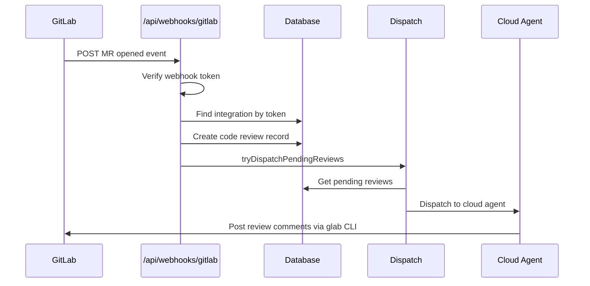

# GitLab Code Review Integration - Next Steps & Testing Guide

## Current Implementation Status

The core GitLab webhook infrastructure is complete:

- ✅ Webhook endpoint at `/api/webhooks/gitlab`
- ✅ MR event handling and code review creation
- ✅ Platform-specific prompt generation
- ✅ Database schema with `platform` column
- ✅ Dispatch and payload preparation for GitLab

## What's Missing for End-to-End Testing

### 1. Create a GitLab Platform Integration Record

Before webhooks can work, you need a `platform_integrations` record for GitLab. This is normally created via OAuth flow, but for testing you can insert one manually.

**Option A: Manual Database Insert (for testing)**

```sql
INSERT INTO platform_integrations (
  owned_by_organization_id,  -- OR owned_by_user_id
  platform,
  integration_type,
  integration_status,
  repository_access,
  metadata
) VALUES (
  'your-org-uuid-here',  -- Get from organizations table
  'gitlab',
  'oauth',
  'active',
  'all',
  '{
    "access_token": "your-gitlab-personal-access-token",
    "webhook_secret": "your-webhook-secret-token",
    "instance_url": "https://gitlab.com"
  }'::jsonb
);
```

**Option B: Create GitLab OAuth Flow (production)**

This requires implementing:

- `/api/integrations/gitlab/connect` - Initiates OAuth
- `/api/integrations/gitlab/callback` - Handles OAuth callback
- UI in `/code-reviews` to trigger the flow

### 2. Create Agent Config for GitLab

```sql
INSERT INTO agent_configs (
  owned_by_organization_id,  -- OR owned_by_user_id
  agent_type,
  platform,
  config,
  is_enabled,
  created_by
) VALUES (
  'your-org-uuid-here',
  'code_review',
  'gitlab',
  '{"model_slug": "anthropic/claude-sonnet-4-20250514"}'::jsonb,
  true,
  'your-user-id'
);
```

### 3. Run Database Migration

```bash
pnpm drizzle-kit push
# OR
pnpm drizzle-kit migrate
```

### 4. Update Cloud Agent to Support GitLab Token

The cloud-agent needs to handle `gitlabToken` in the session input and set `GITLAB_TOKEN` environment variable.

**File to modify:** `cloud-agent/src/session-service.ts`

Look for where `GH_TOKEN` is set and add similar logic for `GITLAB_TOKEN`:

```typescript
// Around line 321-323 where GH_TOKEN is set
if (sessionInput.gitlabToken) {
  envVars['GITLAB_TOKEN'] = sessionInput.gitlabToken;
}
```

## Testing Steps

### Step 1: Set Up GitLab Project

1. Create or use an existing GitLab project
2. Go to **Settings > Webhooks**
3. Add a new webhook:
   - **URL**: `https://your-kilo-domain.com/api/webhooks/gitlab` (or use ngrok for local testing)
   - **Secret token**: Generate a random string (e.g., `openssl rand -hex 32`)
   - **Trigger**: Check "Merge request events"
   - **SSL verification**: Enable if using HTTPS

### Step 2: Create Platform Integration

Use the SQL from above, making sure:

- `webhook_secret` matches what you set in GitLab
- `access_token` is a GitLab Personal Access Token with `api` scope (for posting comments)

### Step 3: Create Agent Config

Use the SQL from above to enable code reviews for GitLab.

### Step 4: Test with a Merge Request

1. Create a new branch in your GitLab project
2. Make some code changes
3. Create a Merge Request
4. Watch the logs for webhook processing

### Step 5: Verify in Database

```sql
-- Check if webhook was received
SELECT * FROM webhook_events
WHERE platform = 'gitlab'
ORDER BY created_at DESC
LIMIT 5;

-- Check if code review was created
SELECT * FROM cloud_agent_code_reviews
WHERE platform = 'gitlab'
ORDER BY created_at DESC
LIMIT 5;
```

## Local Development Testing with ngrok

1. Start your local dev server:

   ```bash
   pnpm dev
   ```

2. Start ngrok to expose your local server:

   ```bash
   ngrok http 3000
   ```

3. Use the ngrok URL in GitLab webhook settings:

   ```
   https://abc123.ngrok.io/api/webhooks/gitlab
   ```

4. Create a merge request and watch the terminal logs

## Expected Flow



## Remaining Work for Production

### Phase 1: UI Integration (Required for self-service)

1. **GitLab OAuth Connect Button**
   - Add to `/code-reviews` settings page
   - Implement `/api/integrations/gitlab/connect`
   - Implement `/api/integrations/gitlab/callback`

2. **Webhook Setup Instructions**
   - Show webhook URL after OAuth connection
   - Display webhook secret for user to copy
   - Provide step-by-step GitLab setup guide

### Phase 2: Cloud Agent Updates

1. **Support `gitlabToken` in session input**
   - Set `GITLAB_TOKEN` environment variable
   - Ensure `glab` CLI is available in agent environment

2. **Install glab CLI in agent container**
   - Add to Dockerfile or runtime setup

### Phase 3: Documentation

1. User-facing setup guide for GitLab
2. Troubleshooting common issues
3. Comparison with GitHub setup

## Environment Variables Needed

Add to your `.env.local` or deployment config:

```bash
# GitLab OAuth (for production OAuth flow)
GITLAB_CLIENT_ID=your-gitlab-app-id
GITLAB_CLIENT_SECRET=your-gitlab-app-secret

# GitLab Webhook (fallback if not using per-integration secrets)
GITLAB_WEBHOOK_SECRET=your-default-webhook-secret
```

## Troubleshooting

### Webhook not received

- Check GitLab webhook delivery logs (Settings > Webhooks > Edit > Recent Deliveries)
- Verify URL is accessible from GitLab
- Check SSL certificate if using HTTPS

### Token verification failed

- Ensure `webhook_secret` in metadata matches GitLab webhook secret
- Check for whitespace in the secret

### Code review not created

- Check `webhook_events` table for errors
- Verify `platform_integrations` record exists and is active
- Check `agent_configs` has GitLab enabled

### Review not dispatched

- Check `cloud_agent_code_reviews.status` - should be 'pending' then 'queued'
- Verify cloud agent is running and accessible
- Check for balance/credit issues
