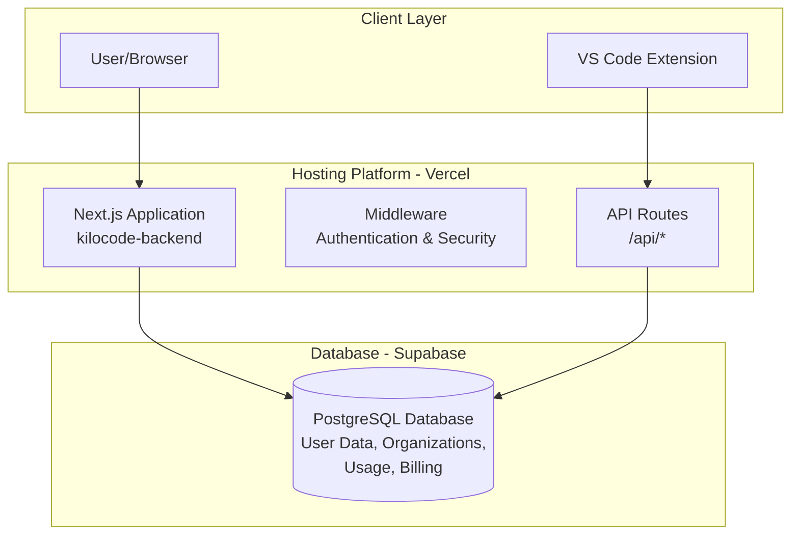
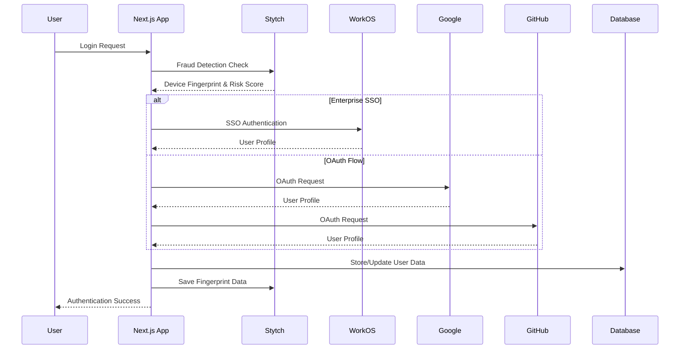
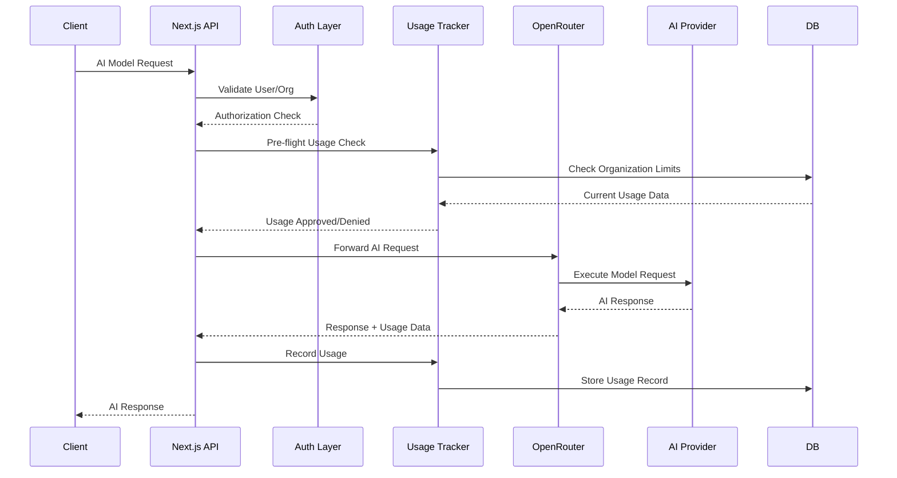
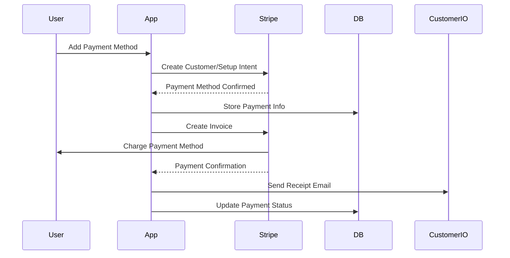

# KiloCode Backend Network Architecture & Compliance Diagram

## System Overview

**KiloCode Backend** - Next.js application providing AI-powered coding assistance with organization management, usage tracking, and billing capabilities.

---

## Infrastructure & Hosting



---

## Complete Service Architecture

```mermaid
graph TB
    subgraph "Users"
        USER[End Users]
        ADMIN[Admin Users]
        ORG[Organization Members]
    end

    subgraph "Client Applications"
        BROWSER[Web Browser]
        VSCODE[VS Code Extension]
    end

    subgraph "Vercel Infrastructure"
        subgraph "Next.js Application"
            APP[Main Application]
            API[API Routes]
            MIDDLEWARE[Middleware Layer]
        end

        subgraph "Application Components"
            AUTH_LAYER[Authentication Layer]
            ADMIN_PANEL[Admin Panel]
            ORG_MGT[Organization Management]
            USAGE_TRACK[Usage Tracking]
        end
    end

    subgraph "Database Layer - Supabase"
        DB[(PostgreSQL Database)]
        subgraph "Database Tables"
            USERS_TBL[Users Table]
            ORGS_TBL[Organizations Table]
            USAGE_TBL[Usage Records]
            BILLING_TBL[Billing Data]
            FINGERPRINT_TBL[Stytch Fingerprints]
        end
    end

    subgraph "Authentication Services"
        STYTCH[Stytch<br/>Fraud Detection & Auth]
        WORKOS[WorkOS<br/>SSO & Enterprise Auth]
        GOOGLE_AUTH[Google OAuth]
        GITHUB_AUTH[GitHub OAuth]
        TURNSTILE[Cloudflare Turnstile<br/>CAPTCHA Protection]
    end

    subgraph "AI/ML Services"
        OPENROUTER[OpenRouter<br/>AI Model Gateway]
        ANTHROPIC[Anthropic<br/>Claude Models]
        OPENAI[OpenAI<br/>GPT Models]
        XAI[xAI/Grok<br/>AI Models]
    end

    subgraph "Payment & Billing"
        STRIPE[Stripe<br/>Payment Processing]
        COINBASE[Coinbase<br/>Crypto Payments]
    end

    subgraph "Monitoring & Analytics"
        SENTRY[Sentry<br/>Error Reporting & APM]
        POSTHOG[PostHog<br/>Product Analytics]
    end

    subgraph "Communication"
        CUSTOMERIO[Customer.io<br/>Email Marketing & Transactional]
    end

    %% User Connections
    USER --> BROWSER
    USER --> VSCODE
    ADMIN --> BROWSER
    ORG --> BROWSER

    %% Client to Application
    BROWSER --> APP
    VSCODE --> API

    %% Application Internal Flow
    APP --> AUTH_LAYER
    APP --> ADMIN_PANEL
    APP --> ORG_MGT
    APP --> USAGE_TRACK
    API --> AUTH_LAYER
    API --> USAGE_TRACK

    %% Database Connections
    APP --> DB
    API --> DB
    DB --> USERS_TBL
    DB --> ORGS_TBL
    DB --> USAGE_TBL
    DB --> BILLING_TBL
    DB --> FINGERPRINT_TBL

    %% Authentication Flow
    AUTH_LAYER --> STYTCH
    AUTH_LAYER --> WORKOS
    AUTH_LAYER --> GOOGLE_AUTH
    AUTH_LAYER --> GITHUB_AUTH
    AUTH_LAYER --> TURNSTILE

    %% AI Services Flow
    API --> OPENROUTER
    OPENROUTER --> ANTHROPIC
    OPENROUTER --> OPENAI
    OPENROUTER --> XAI

    %% Payment Flow
    APP --> STRIPE
    APP --> COINBASE

    %% Monitoring Flow
    APP --> SENTRY
    API --> SENTRY
    APP --> POSTHOG
    API --> POSTHOG

    %% Communication Flow
    APP --> CUSTOMERIO

    %% Data Flow Styling
    classDef userClass fill:#e1f5fe
    classDef clientClass fill:#f3e5f5
    classDef appClass fill:#e8f5e8
    classDef dbClass fill:#fff3e0
    classDef authClass fill:#fce4ec
    classDef aiClass fill:#e3f2fd
    classDef paymentClass fill:#f1f8e9
    classDef monitorClass fill:#fff8e1
    classDef commClass fill:#fafafa

    class USER,ADMIN,ORG userClass
    class BROWSER,VSCODE clientClass
    class APP,API,MIDDLEWARE,AUTH_LAYER,ADMIN_PANEL,ORG_MGT,USAGE_TRACK appClass
    class DB,USERS_TBL,ORGS_TBL,USAGE_TBL,BILLING_TBL,FINGERPRINT_TBL dbClass
    class STYTCH,WORKOS,GOOGLE_AUTH,GITHUB_AUTH,TURNSTILE authClass
    class OPENROUTER,ANTHROPIC,OPENAI,XAI aiClass
    class STRIPE,COINBASE paymentClass
    class SENTRY,POSTHOG monitorClass
    class CUSTOMERIO commClass
```



---

## Data Flow & Security Analysis

### 1. **Authentication & Authorization Flow**



### 2. **AI Request Flow**



### 3. **Payment & Billing Flow**



---

## Compliance & Security Considerations

### **Data Protection & Privacy**

| Service         | Data Type                                    | Location      | Compliance            |
| --------------- | -------------------------------------------- | ------------- | --------------------- |
| **Supabase**    | User profiles, usage data, organization data | EU/US regions | GDPR, SOC 2           |
| **Stytch**      | Device fingerprints, fraud scores            | US            | SOC 2, Privacy Shield |
| **Stripe**      | Payment data, customer billing info          | Global        | PCI DSS, GDPR         |
| **Sentry**      | Error logs, performance data                 | US/EU         | GDPR, SOC 2           |
| **PostHog**     | Analytics events, feature flags              | US/EU         | GDPR                  |
| **Customer.io** | Email addresses, communication preferences   | US            | GDPR, CAN-SPAM        |

### **Security Measures**

#### **Authentication Security**

- ✅ Multi-provider OAuth (Google, GitHub)
- ✅ Enterprise SSO via WorkOS
- ✅ Device fingerprinting via Stytch
- ✅ Cloudflare Turnstile CAPTCHA protection
- ✅ JWT token signing with NEXTAUTH_SECRET

#### **API Security**

- ✅ Request authentication middleware
- ✅ Rate limiting (model-specific)
- ✅ Usage quota enforcement
- ✅ Organization-based access control
- ✅ Input validation with Zod schemas

#### **Data Security**

- ✅ Environment variable protection
- ✅ Database connection pooling with timeouts
- ✅ Encrypted database connections
- ✅ Secure payment processing via Stripe
- ✅ Error boundary with Sentry

### **Network Security**

#### **External API Calls**

```
HTTPS Endpoints:
├── Stytch API (Authentication/Fraud)
├── WorkOS API (SSO)
├── OpenRouter API (AI Models)
├── Stripe API (Payments)
├── Sentry API (Error Reporting)
├── PostHog API (Analytics)
├── Customer.io API (Email)
└── Coinbase API (Crypto Payments)
```

#### **Security Headers & Configuration**

- Content Security Policy (CSP)
- HTTP Referer validation for OpenRouter
- API key rotation support
- Environment-specific configurations

### **Compliance Requirements**

#### **GDPR Compliance**

- ✅ Data minimization (collect only necessary data)
- ✅ User data deletion across all services
- ✅ Explicit consent for analytics
- ✅ Data portability support
- ✅ Privacy by design architecture

#### **SOC 2 Compliance**

- ✅ Access controls and authentication
- ✅ Data encryption in transit and at rest
- ✅ Audit logging and monitoring
- ✅ Incident response procedures
- ✅ Vendor security assessments

#### **PCI DSS Compliance**

- ✅ No direct payment data storage
- ✅ Stripe handles all payment processing
- ✅ Secure API communication
- ✅ Regular security monitoring

### **Risk Assessment**

| Risk Level | Component           | Mitigation                                  |
| ---------- | ------------------- | ------------------------------------------- |
| **HIGH**   | Payment Processing  | Stripe PCI DSS compliance, no local storage |
| **HIGH**   | AI Model Access     | Rate limiting, usage quotas, authentication |
| **MEDIUM** | User Authentication | Multi-factor options, fraud detection       |
| **MEDIUM** | Data Storage        | Encrypted connections, regular backups      |
| **LOW**    | Analytics           | Anonymized data, GDPR compliance            |
| **LOW**    | Error Reporting     | Sanitized logs, no PII in errors            |

---

## Monitoring & Observability

### **Error Monitoring (Sentry)**

- Application errors and exceptions
- Performance monitoring (APM)
- Release tracking and deployment monitoring
- User feedback collection
- Security issue detection

### **Product Analytics (PostHog)**

- User behavior tracking
- Feature flag management
- Conversion funnel analysis
- A/B testing capabilities
- Custom event tracking

### **Business Metrics**

- Revenue metrics via Stripe
- User engagement via PostHog
- System performance via Sentry

---

## Backup & Disaster Recovery

### **Database Backups**

- Automated Supabase backups
- Point-in-time recovery capability
- Cross-region backup replication

### **Configuration Management**

- Environment variable backup via dotenvx
- Infrastructure as Code (Vercel config)
- Automated deployment rollback capability

### **Third-party Service Continuity**

- Multi-provider AI model support
- Fallback authentication methods
- Payment processing redundancy

---

_Generated: 2025-09-30 | Version: 1.0_
_Compliance Review Date: [To be scheduled]_
